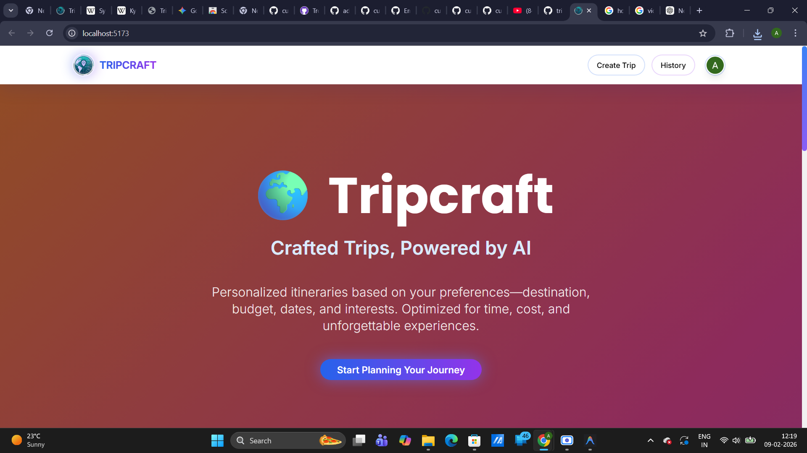

# 🌍 Tripcraft — Crafted Trips, Powered by AI

Tripcraft is an AI-powered, end-to-end travel planning platform that designs personalized itineraries based on user preferences. By leveraging advanced technologies like the Gemini API, Firebase, and intelligent location services such as OpenStreetMap and Nominatim, Tripcraft transforms travel planning into a seamless, intelligent experience.

## 🎥 Demo

https://github.com/cupcakesandcodes/tripcraft/blob/master/public/screen-capture.webm

> Watch Tripcraft in action - from trip creation to PDF export!

---




> From solo getaways to family vacations, Tripcraft offers a complete trip planning solution in a clean, responsive, and engaging UI.

---

## 🔍 Overview

Tripcraft leverages advanced technologies like the Gemini API, Firebase, and location services such as OpenStreetMap and Nominatim to plan trips end-to-end. Users simply provide details such as destination, budget, travel dates, number of travelers, and interests. Tripcraft then generates a detailed, AI-curated itinerary optimized for time, cost, and experience—covering attractions, routes, and daily schedules from start to finish.

Key components:
- **AI-generated trip plan**
- **Real-time hotel recommendations**
- **Dynamic, day-wise itinerary**
- **Modern, mobile-first UI**
- **Secure Google login**
- **Trip history management**

---

## 🌐 Live Application

**URL**: [Tripcraft](https://wander-wise-app.netlify.app/) 

---

## 📦 Tech Stack

### Frontend
- **React.js** with Vite
- **Tailwind CSS** for responsive styling
- **TypeScript** for code safety and scalability
- **ShadCN UI** components
- **Framer Motion** for smooth animations
- **Lucide-React** icons
- **jsPDF** + **html2canvas** for PDF export

### Backend Services & APIs
- **Firebase Authentication**: Secure Google Sign-in
- **Firebase Firestore**: Persistent trip data storage
- **Gemini API (by Google)**: AI-based travel content generation
- **Pexels API**: Destination and hotel image content
- **OpenStreetMap + Leaflet.js**: Free and responsive mapping
- **Nominatim API**: Free geocoding for location coordinates
- **LocationIQ / OpenCage**: Place search and autocomplete

---

## 📱 Features

### Core Features
- **Google OAuth secure login** (Firebase)
- **Dynamic form** to input travel parameters
- **Gemini AI integration** for itinerary generation
- **Hotel listings** with image, location, ratings, price
- **Day-wise trip plan** with maps, timings, and attractions
- **Trip history** with CRUD support using Firestore

### Modern UI/UX
- **Animated gradient backgrounds** with smooth color transitions
- **Glassmorphism effects** on header with backdrop blur
- **Gradient text effects** and modern typography (Poppins + Inter fonts)
- **Smooth animations** (fade-in, floating, pulse-glow effects)
- **Enhanced card designs** with hover effects and shadows
- **Responsive design** optimized for all screen sizes
- **Mobile-first layout** with adapted cards and layouts

### Export & Sharing
- **PDF Export** - Download complete itineraries as professional PDF documents
- **Multi-page PDF support** for long trips
- **Custom filenames** based on destination

### Additional Features
- Real-time geolocation detection
- Custom scrollbar with gradient styling
- Professional color palette (blue to purple gradients)

---


## ⚙️ Environment Variables

To run this project, you’ll need the following variables in a `.env.local` file:

```env
VITE_LOCATIONIQ_API_KEY=your_locationiq_api_key_here

VITE_GGOGLE_GEMINI_AI_API_KEY=your_gemini_api_key_here
VITE_GOOGLE_AUTH_CLIENT_ID=your_google_oauth_client_id_here

VITE_PEXELS_API_KEY=your_pexels_api_key_here

VITE_FIREBASE_API_KEY=your_firebase_api_key_here
VITE_FIREBASE_AUTH_DOMAIN=your_firebase_auth_domain_here
VITE_FIREBASE_PROJECT_ID=your_firebase_project_id_here
VITE_FIREBASE_STORAGE_BUCKET=your_firebase_storage_bucket_here
VITE_FIREBASE_MESSAGING_SENDER_ID=your_firebase_messaging_sender_id_here
VITE_FIREBASE_APP_ID=your_firebase_app_id_here
VITE_FIREBASE_MEASUREMENT_ID=your_firebase_measurement_id_here
```

## 🧾 Acknowledgements

- [Google Gemini API](https://deepmind.google/technologies/gemini/)
- [Firebase](https://firebase.google.com/)
- [Pexels API](https://www.pexels.com/api/)
- [OpenStreetMap](https://www.openstreetmap.org/)
- [Nominatim](https://nominatim.org/)
- [LocationIQ](https://locationiq.com/)

